# 制造装备物联及生产管理平台需求分析

------

## 1. 项目背景与目标

制造装备物联及生产管理平台旨在通过信息化手段，实现对生产制造过程中的设备、工艺、计划、产品等关键环节的高效管理和全面监控。平台支持用户登录、基础信息管理、计划进度管理、工艺监控管理等功能模块，为企业提供精细化管理和高效运营的解决方案。

## 2. 功能需求

### 2.1 登录模块

- **功能描述**

  - 用户通过用户名和密码登录系统。
  - 支持记住密码功能，提升用户体验。

------

### 2.2 系统管理模块

#### 2.2.1 角色管理

- **功能描述**

  - 分页展示角色数据，支持通过用户手机号码、用户名称和状态等查询。
  - 新增角色时，需要创建权限。
  - 支持修改角色权限，点击权限字段进行编辑。

#### 2.2.2 用户管理

- **功能描述**

  - 分页展示用户数据，支持按权限、状态和角色名称查询角色信息。
  - 支持新增用户，用户状态可设置为“正常”或“停用”，角色信息来源于角色管理。

------

### 2.3 计划进度模块

#### 2.3.1 客户管理

- **功能描述**

  - 支持客户基本信息录入，包括客户编号、名称、全称、地址、联系方式、状态等。
  - 提供新增、编辑、删除和搜索客户信息的功能。
  - 支持按编号、状态和名称查询客户信息。

#### 2.3.2 产品管理

- **功能描述**

  - 提供全面的产品信息管理，包括编号、名称、种类、状态（停产/有效）、产品介绍等。
  - 支持新增、编辑、删除产品数据，以及支持按编号、状态、类型和名称查询产品信息。

------

### 2.4 工艺监控模块

#### 2.4.1 工艺管理

- **功能描述**

  - 支持创建、编辑、删除生产工艺路线。
  - 定义工艺编号、名称、外协价格、瓶颈工序工期、标准能力等信息。
  - 支持按编号、和名称查询工艺信息。

#### 2.4.2 工艺要求

- **功能描述**

  - 支持创建、编辑、删除工艺要求，记录工艺编号、名称、具体要求、添加/修改时间等。
  - 支持按编号、和名称查询工艺要求信息。

#### 2.4.3 工艺计划

- **功能描述**

  - 支持创建、编辑、删除工艺计划，记录计划编号、名称、批次数量、起止时间等信息。
  - 支持根据计划编号或工艺名称快速筛选相关计划信息。

#### 2.4.4 工序管理

- **功能描述**

  - 对工序编号、计划编号、顺序、单件工时等进行管理。
  - 支持根据计划编号或工艺计划名称快速筛选相关工序信息。

------

## 3. 系统功能结构图

------

## 4. 非功能性需求

- **安全性**：系统需满足企业信息安全规范，防止数据泄漏。
- **性能**：系统应支持高并发访问，确保在高负载情况下依然稳定运行。
- **可用性**：提供友好的用户界面，支持快捷操作。
- **可扩展性**：系统设计需支持未来功能扩展。

## 5. 需求总结

- 实现从用户登录到生产管理的全流程覆盖。
- 确保系统功能模块间协同工作，数据互通互联。
- 注重用户体验，优化操作逻辑和界面设计。

# 制造装备物联及生产管理平台设计说明

------

## 1. 系统概述

制造装备物联及生产管理平台旨在实现对生产制造过程中的设备、工艺、计划、产品等关键环节的全面信息化管理。系统分为登录模块、计划进度模块和工艺监控模块三大核心部分，具有数据的集中管理与高效处理能力。

------

## 2. 系统架构设计

### 2.1 技术架构
整体基于RuoYi前后端分离式框架:
- 前端采用Vue、Element Ul。
- 后端采用Spring Boot、Spring Security、Redis & Jwt。
- 权限认证使用Jwt，支持多终端认证系统。
- 支持加载动态权限菜单，多方式轻松权限控制。
- 采用 MySQL 存储系统数据，Redis数据库缓存，支持复杂查询及高并发。

### 2.2 系统逻辑架构

- **客户端层**：通过浏览器访问系统。
- **服务层**：提供用户认证、业务逻辑处理、权限控制等服务。
- **数据层**：提供数据的存储、查询与管理。

------

## 3. 功能设计

### 3.1 登录模块

- **页面设计**
  - 提供用户登录界面，包含用户名、密码、验证码输入框，以及记住密码复选框。
  - 登录失败时提示具体错误信息。
- **业务逻辑**
  - 进行用户名密码验证，采用JWT(JSON Web Token)加密方式传输。

------

### 3.2 系统管理模块

#### 3.2.1 角色管理

- **界面设计**
  - 角色管理页面展示所有角色信息，包含角色编号、角色名称、权限等。
  - 提供角色查询框和新增、修改功能按钮。
- **业务逻辑**
  - 新增角色时，需要确定角色权限。
  - 修改权限时实时更新数据库，并对操作进行记录。

#### 3.2.2 用户管理

- **界面设计**
  - 用户管理页面以表格形式展示用户信息，包括用户编号、用户名、状态等。
  - 支持新增、编辑用户信息以及锁定/解锁用户。
- **业务逻辑**
  - 用户状态变更时，需触发通知系统，确保相关权限生效。

------

### 3.3 计划进度模块

#### 3.3.1 客户管理

- **界面设计**
  - 客户列表页面显示客户的基础信息，如客户编号、名称、联系方式等。
  - 提供搜索框和编辑、删除、新增、导出等功能。
- **业务逻辑**
  - 客户信息新增或编辑后需进行唯一性校验（如编号）。
  - 删除客户需验证其是否关联业务数据。

#### 3.3.2 产品管理

- **界面设计**
  - 产品管理页面以表格形式展示产品信息，支持按编号、名称、种类筛选。
  - 提供新增、编辑、删除、导出等功能。
- **业务逻辑**
  - 产品新增或编辑时需校验其状态（无效/有效）。
  - 查询结果分页展示，避免数据量大时影响性能。

------

### 3.4 工艺监控模块

#### 3.4.1 工艺管理

- **界面设计**
  - 工艺管理页面展示所有工艺信息，包括工艺编号、名称、瓶颈工序等。
  - 提供新增、编辑、删除工艺、查找、导出的功能按钮。

#### 3.4.2 工艺要求

- **界面设计**
  - 工艺要求页面以表格形式展示工艺编号、名称、要求等。
  - 提供新增、编辑、删除、查找、导出的功能按钮。
- **业务逻辑**
  - 工艺要求编辑后需记录修改时间。

#### 3.4.3 工艺计划

- **界面设计**
  - 工艺计划页面以表格展示计划编号、名称、起止时间、批次数量等。
  - 提供新增、编辑、查找和删除的功能按钮。

#### 3.4.4 工序管理

- **界面设计**
  - 工序管理页面展示工序编号、计划编号、顺序等信息。
  - 提供新增、编辑、查找和删除的功能按钮。
- **业务逻辑**
  - 工序管理需与工艺计划联动，确保数据一致性。

------

## 4. 数据库设计

- **主要表结构**
  - 用户表（`craftmen_users`）：存储用户信息，包括编号、用户名、密码、角色和状态等。
  - 角色表（`craftmen_roles`）：存储角色信息，包括编号、名称、描述等。
  - 客户表（`craftmen_customers`）：存储客户基本信息，包括编号、名称、地址、联系方式等。
  - 产品表（`craftmen_products`）：存储产品信息，包括编号、名称、类型、描述、状态等。
  - 工艺表（`craftmen_processes`）：存储工艺信息，包括编号、名称、外协价格、能力数据等。
  - 工艺要求表（`craftmen_process_requirements`）：记录各工艺的具体要求。
  - 工艺计划表（`craftmen_process_plans`）：存储工艺计划的编号、批次数量、计划时间等信息。
  - 工序表（`craftmen_procedures`）：存储工序管理的详细数据，包括工序顺序、定额工时等。

## 5. 用户界面设计

### 5.1. 交互界面概述

- **登录页面**

  - 包含用户名、密码输入框，记住密码复选框，登录按钮。

- **菜单管理页面**

  - 包含角色管理和用户管理。

- **计划进度页面**

  - 包含客户管理和产品管理。

- **工艺监控页面**

  - 包含工艺管理、工艺要求、工艺计划、工序管理。

------

### 5.2. 样式项目结构介绍

引用官方文档的前端设计如下:

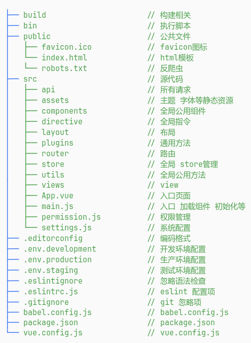

#### 5.2.1. `craftMen-ui/src/views/tool/build`目录

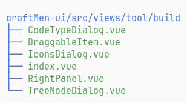

1. **CodeTypeDialog.vue**
   - **作用**：用于创建或编辑代码类型的对话框界面。通常在工具或生成模块中用于用户选择或设置代码类型。
   - **功能**：包含表单、按钮和输入框，用户可以在其中选择或输入相关的代码类型。

2. **DraggableItem.vue**
   - **作用**：实现拖拽功能的组件。通常用于在界面上拖动并重新排列元素。
   - **功能**：为某些可视化元素（如列表项、表格项等）提供拖拽排序功能，增强用户交互体验。

3. **IconsDialog.vue**
   - **作用**：显示图标选择的对话框。
   - **功能**：允许用户选择和确认图标，通常在生成或配置某些功能时使用图标选择界面。

4. **index.vue**
   - **作用**：这个组件作为工具界面的入口，通常用来展示或初始化生成器、工具集等。
   - **功能**：负责加载和管理与该模块相关的视图和子组件。

5. **RightPanel.vue**
   - **作用**：右侧面板组件，用于展示某些动态内容或操作面板。
   - **功能**：例如，显示一些工具选项、操作日志、配置参数等，提升界面的互动性。

6. **TreeNodeDialog.vue**
   - **作用**：树节点对话框，用于编辑树结构中的节点。
   - **功能**：在树形结构中添加、修改或删除节点，并提供对树节点的各种操作和配置。

------

#### 5.2.2. `craftMen-ui/src/components`目录

1. **Breadcrumb**
   - **作用**：面包屑导航组件，用于显示当前位置的路径。
   - **功能**：帮助用户了解当前页面的位置，提供便捷的返回路径。

2. **Crontab**
   - **作用**：定时任务组件。
   - **功能**：用于配置和管理系统中的定时任务，通常用于设置周期性任务。

3. **DictTag**
   - **作用**：字典标签组件，用于显示标签化的字典数据。
   - **功能**：以标签形式展示字典数据，支持快速查看和操作。

4. **Editor**
   - **作用**：富文本编辑器组件。
   - **功能**：提供丰富的文本编辑功能，支持格式化文本、插入图片等操作。

5. **FileUpload**
   - **作用**：文件上传组件。
   - **功能**：实现文件的上传功能，支持选择文件、上传进度等功能。

6. **Hamburger**
   - **作用**：汉堡菜单组件，通常用于移动端界面。
   - **功能**：点击后展开或收起侧边栏的菜单，节省空间，提升可用性。

7. **HeaderSearch**
   - **作用**：头部搜索组件。
   - **功能**：在页面头部提供搜索框，用户可以快速搜索应用中的内容。

8. **IconSelect**
   - **作用**：图标选择器组件。
   - **功能**：帮助用户在一组图标中选择一个作为输入，常用于配置类应用。

9. **iFrame**
   - **作用**：`iframe`组件。
   - **功能**：用于在当前页面嵌入外部网页或应用，通常用于嵌入其他网页或系统模块。

10. **ImagePreview**
    - **作用**：图片预览组件。
    - **功能**：允许用户查看图片的预览，通常用于查看大图或缩略图。

11. **ImageUpload**
    - **作用**：图片上传组件。
    - **功能**：用于上传图片，支持多文件上传和进度显示等功能。

12. **Pagination**
    - **作用**：分页组件。
    - **功能**：用于分页展示数据，支持跳转、下一页、上一页等功能。

13. **ParentView**
    - **作用**：父视图组件，用于显示子视图。
    - **功能**：管理并展示子视图的内容，适用于复杂的父子页面结构。

14. **RightToolbar**
    - **作用**：右侧工具栏组件。
    - **功能**：为用户提供常用工具或功能按钮，通常在页面右侧展示。

15. **RuoYi**
    - **作用**：RuoYi 系统的相关组件。
    - **功能**：与RuoYi管理系统集成，用于展示一些特定功能。

16. **Screenfull**
    - **作用**：全屏显示组件。
    - **功能**：将页面切换为全屏模式，通常用于需要大屏展示的应用。

17. **SizeSelect**
    - **作用**：选择页面显示大小组件。
    - **功能**：提供页面大小调整功能，通常用于表格或列表的显示。

18. **SvgIcon**
    - **作用**：SVG图标组件。
    - **功能**：用SVG图形显示图标，常用于响应式和高分辨率显示。

19. **TopNav**
    - **作用**：顶部导航组件。
    - **功能**：展示应用的顶部导航栏，通常包含用户头像、通知等信息。

------

#### 5.2.3. `craftMen-ui/src/layout/components`目录

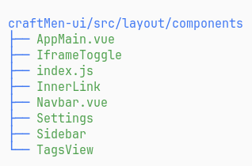

1. **AppMain.vue**
   - **作用**：应用主页面布局的核心组件。
   - **功能**：包含整个应用的主框架，通常包括页面的导航栏、侧边栏和内容区，是应用的主要显示区。

2. **IframeToggle**
   - **作用**：用于管理和切换`iframe`的显示状态。
   - **功能**：可以控制嵌入页面的`iframe`是否显示，适用于需要嵌入外部页面的场景。

3. **index.js**
   - **作用**：导出该目录下所有布局组件的入口文件。
   - **功能**：为其他模块或组件提供一个统一的入口，方便导入和使用布局相关组件。

4. **InnerLink**
   - **作用**：用于内部链接导航的组件。
   - **功能**：实现页面内部的跳转链接，通常用于页面跳转或嵌套的路由功能。

5. **Navbar.vue**
   - **作用**：导航栏组件，用于管理页面顶部的导航条。
   - **功能**：显示应用的主要导航选项，帮助用户在不同页面或功能模块间切换。

6. **Settings**
   - **作用**：设置面板组件，通常包含应用的配置项和操作界面。
   - **功能**：展示系统设置、用户配置等功能，提供自定义选项。

7. **Sidebar**
   - **作用**：侧边栏组件，用于显示应用的菜单。
   - **功能**：包含菜单项，帮助用户进行功能导航，通常支持折叠和展开。

8. **TagsView**
   - **作用**：标签视图组件，用于展示多标签页的功能。
   - **功能**：用于管理页面中打开的标签页，可以方便地切换和关闭标签页。

------

#### 5.2.4. `craftMen-ui/src/assets/styles`目录

1. **btn.scss**
   - **作用**：按钮样式文件。
   - **功能**：定义全局按钮的样式，包括颜色、边框、大小等。

2. **element-ui.scss**
   - **作用**：Element UI样式文件。
   - **功能**：提供Element UI的定制化样式，用于覆盖默认的Element UI样式。

3. **index.scss**
   - **作用**：主样式文件。
   - **功能**：该文件用于引入项目中的全局样式和其他必要的样式资源。

4. **mixin.scss**
   - **作用**：样式混入文件。
   - **功能**：存放多个常用的CSS混入（mixin）代码，以便在其他样式中复用。

5. **ruoyi.scss**
   - **作用**：RuoYi 系统样式文件。
   - **功能**：与RuoYi管理系统风格相关的样式，用于统一界面的外观。

6. **sidebar.scss**
   - **作用**：侧边栏样式文件。
   - **功能**：定义侧边栏的外观样式，如背景色、边框、折叠动画等。

7. **transition.scss**
   - **作用**：过渡动画样式文件。
   - **功能**：为页面元素添加过渡效果，通常用于过渡动画的定义。

8. **variables.module.scss**
   - **作用**：SCSS变量文件。
   - **功能**：定义项目中使用的各种常量，如颜色、字体大小、间距等。

------

## 6. 安全与性能优化

- **安全性**：
  - 用户登录使用 HTTPS 保障数据传输安全。
  - 角色权限需采用细粒度控制，确保安全性。
  - 数据操作均需记录日志，支持审计。
- **性能优化**：
  - 数据查询与展示采用分页技术。
  - 使用缓存机制（Redis）提高查询响应速度。
  - 数据库优化索引，减少高频查询的性能瓶颈。

------

## 7. 部署说明

- 数据库、前后端服务分离，支持水平扩展。
- 日常备份数据库，防止数据丢失。

# 制造装备物联及生产管理平台使用说明

------

## 1. 系统登录

1. 打开系统登录页面，输入用户名、密码和验证码。

2. 勾选“记住密码”选项以便下次自动填充登录信息。

3. 点击“登录”按钮进入系统主界面。

   

   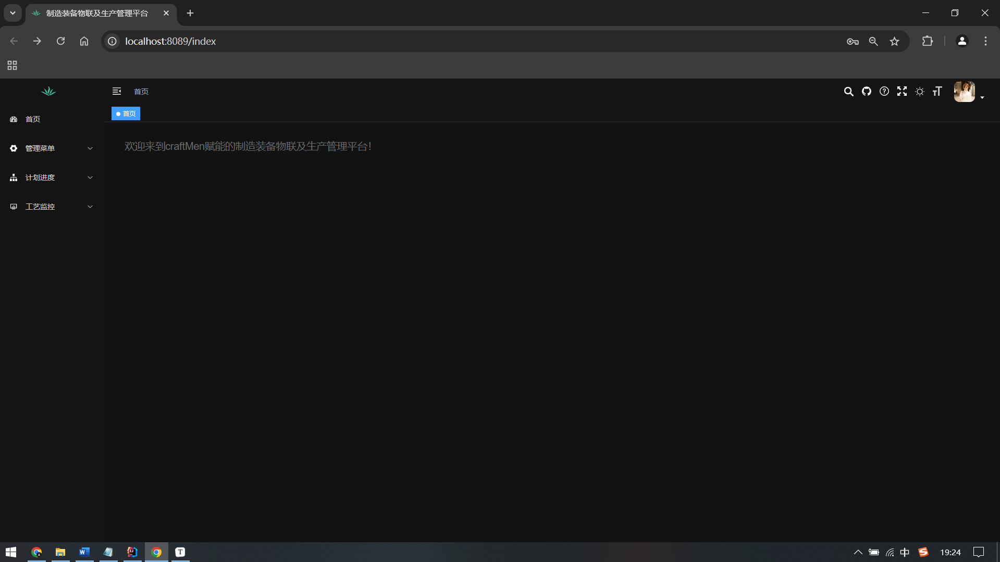

------

## 2. 系统管理

### 2.1 用户管理

**查询用户：**
在用户管理页面，系统以分页形式显示用户列表。支持通过用户手机号码、用户名称和状态等查询。

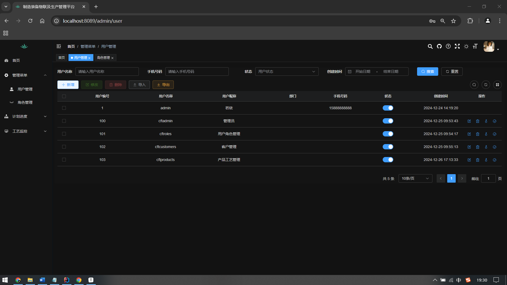

**新增用户：**
点击“新增用户”，输入用户名、密码，选择用户状态（正常/停用）及角色信息等。保存后新增用户即刻生效。

**编辑用户：**
在用户列表中点击“修改”按钮，修改用户信息。保存后更新数据。

**删除用户：**

在用户列表中选择目标用户，点击“删除”按钮确认删除操作。

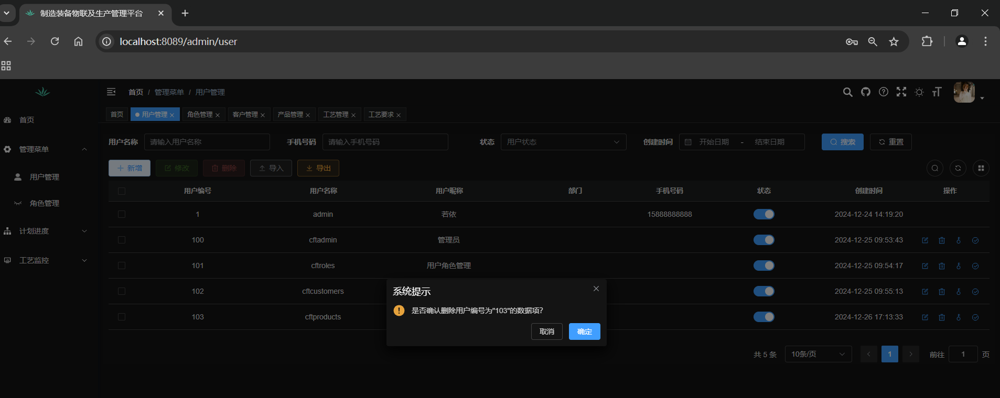

### 2.2 角色管理

**查询角色：**
在角色管理页面，系统以分页形式显示角色列表。支持按权限、状态和角色名称查询角色信息。

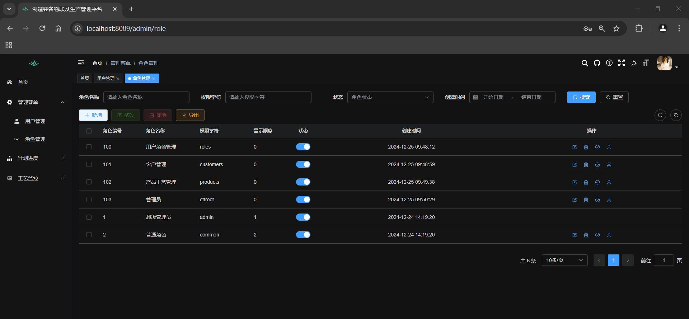

**新增角色：**
点击“新增角色”，输入角色名称，分配权限。

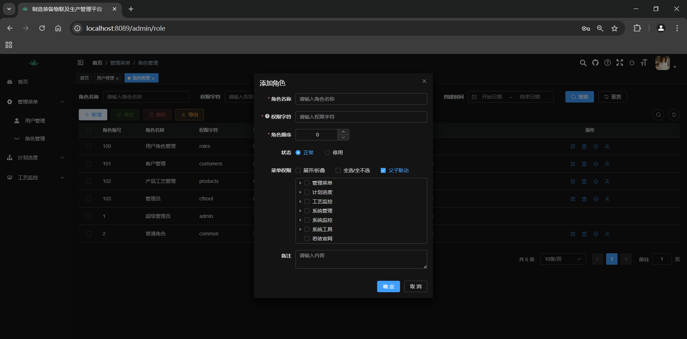

**修改权限：**
在角色列表中点击权限字段，直接修改角色对应的权限。

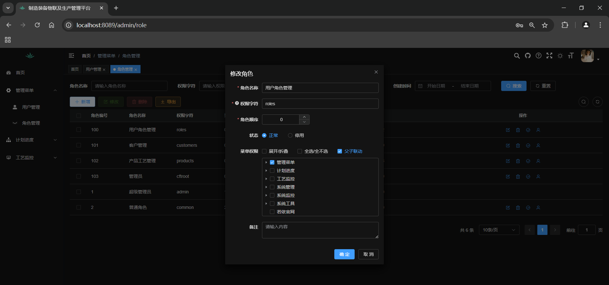

**删除权限：**

在角色列表中选择目标角色，点击“删除”按钮确认删除操作。

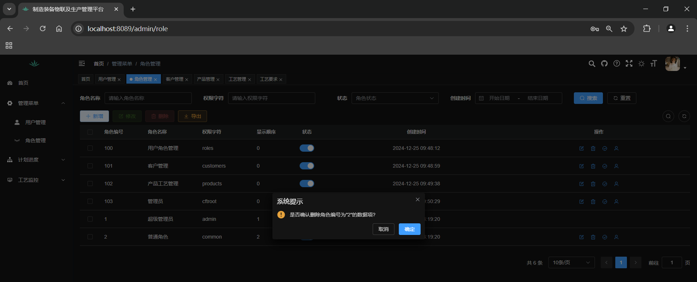

------

## 3. 计划进度

### 3.1 客户管理

**查询客户：**

在客户管理页面，系统以分页形式显示角色列表。支持按编号、状态和名称查询客户信息。

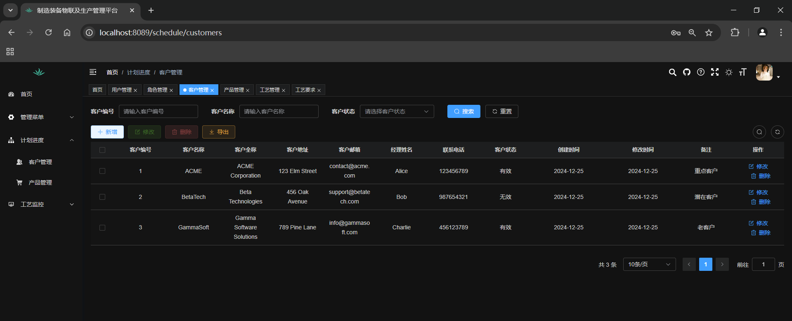

**新增客户：**
点击“新增客户”，填写客户名称、全称、地址、联系方式、状态等信息，保存后客户资料即刻生效。

**编辑客户：**
在客户列表中点击“修改”按钮，修改客户信息并保存。

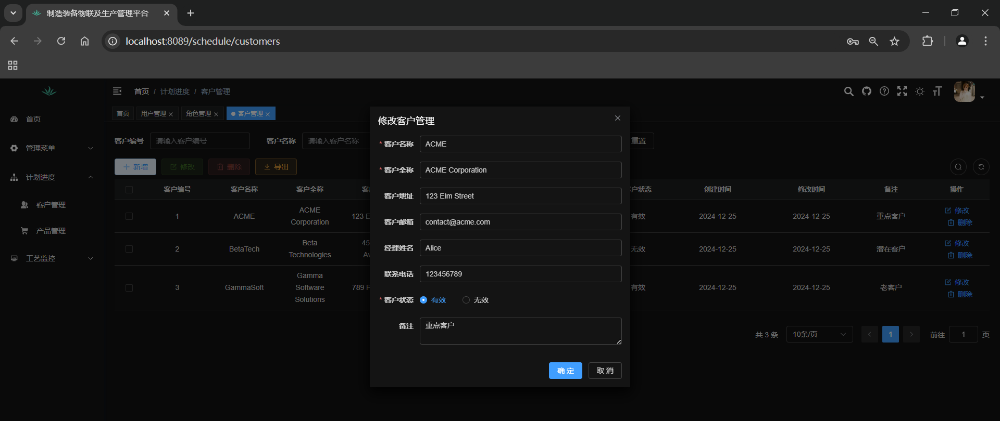

**删除客户：**
在客户列表中选择目标客户，点击“删除”按钮确认删除操作。

### 3.2 产品管理

**查询产品：**

在产品管理页面，系统以分页形式显示产品列表。支持按编号、状态、类型和名称查询产品信息。

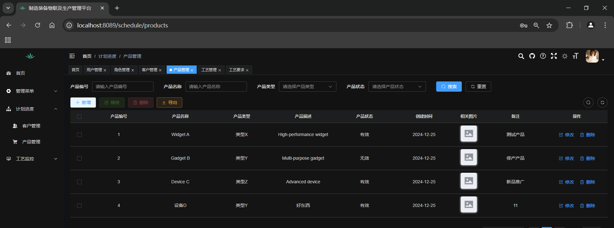

**新增产品：**
点击“新增产品”，填写产品名称、种类、状态（有效/无效）等信息。保存后产品即刻生效。

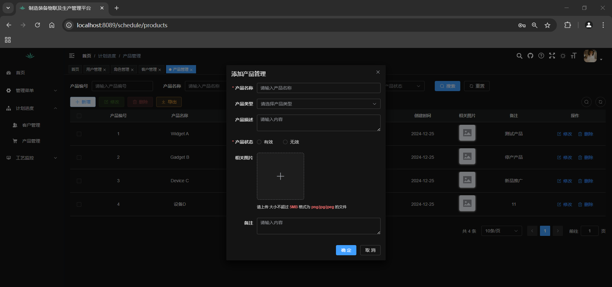

**编辑产品：**
在产品列表中点击“修改”按钮，修改产品信息并保存。

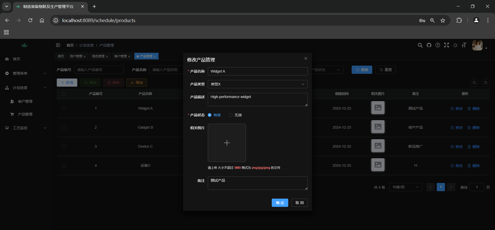

**删除产品信息：**

在产品列表中选择目标产品，点击“删除”按钮确认删除操作。

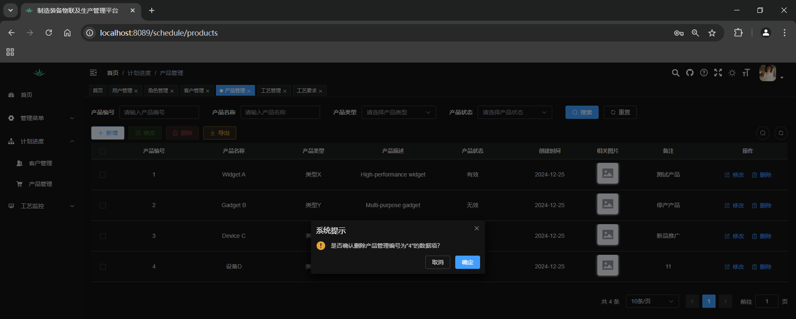

**查询与筛选：**
支持根据产品编号、名称、种类筛选产品列表。

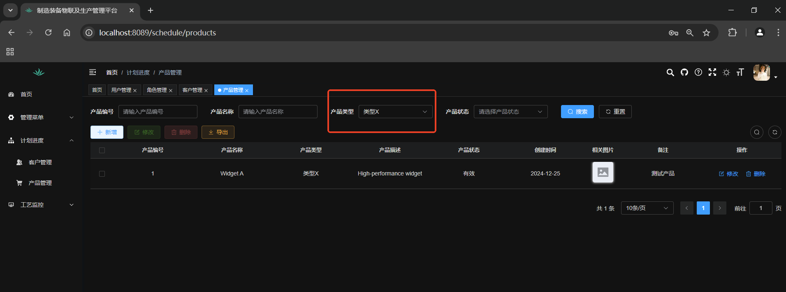

------

## 4. 工艺监控

### 4.1 工艺管理

**查询工艺：**

在工艺管理页面，系统以分页形式显示工艺列表。支持按编号、和名称查询工艺信息。

**新增工艺：**
点击“新增工艺”，填写工艺名称、外协价格、瓶颈工序工期、标准能力等信息，保存后工艺路线即刻生效。

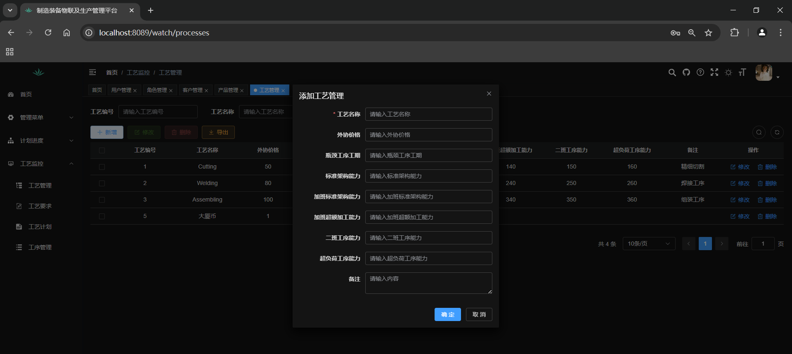

**编辑工艺：**
在工艺列表中点击“修改”按钮，修改工艺信息并保存。

**删除工艺：**

在工艺列表中选择目标工艺，点击“删除”按钮确认删除操作。

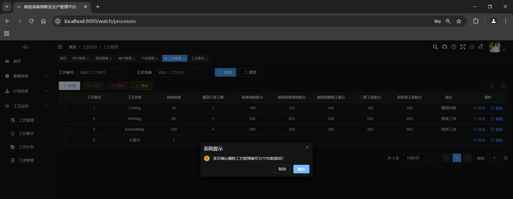

### 4.2 工艺要求

**查询工艺要求：**在工艺要求页面，系统以分页形式显示要求列表。支持按编号、和名称查询工艺要求信息。

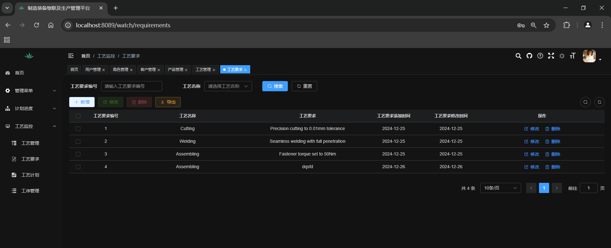

**新增工艺要求：**
点击“新增工艺要求”，填写名称、要求描述等信息，保存后工艺要求即刻生效。

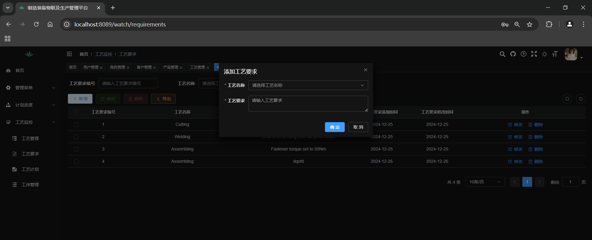

**修改工艺要求：**

在工艺要求列表中点击“修改”按钮，修改工艺要求信息并保存。

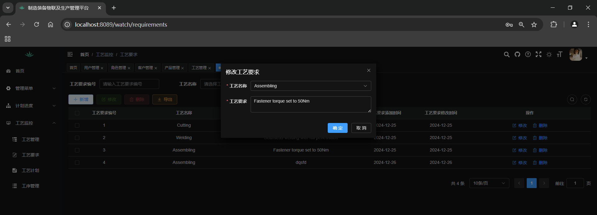

**删除工艺要求：**

在工艺要求列表中选择目标要求，点击“删除”按钮确认删除操作。

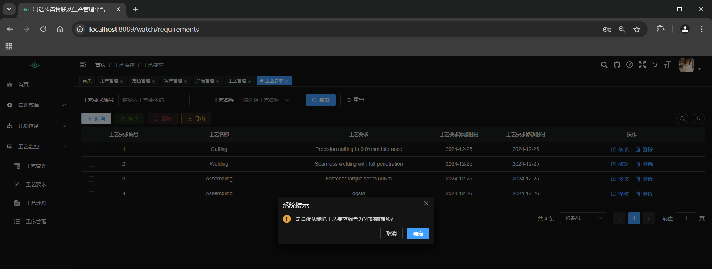

### 4.3 工艺计划

**查询工艺计划：**
支持根据计划编号或工艺名称快速筛选相关计划信息。

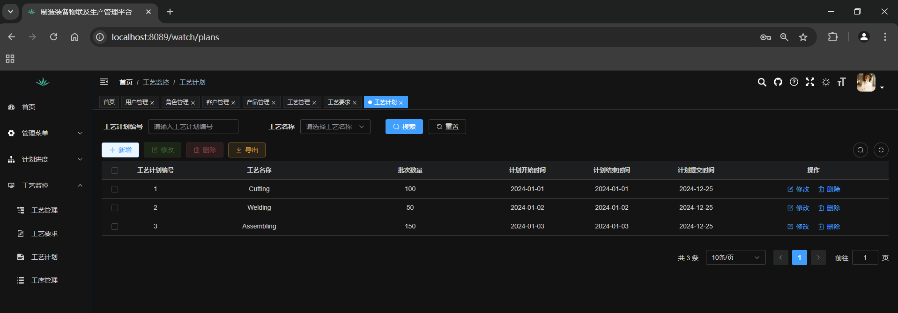

**新增工艺计划：**
点击“新增工艺计划”，填写计划编号、工艺编号、批次数量、计划起止时间等信息，保存后工艺计划即刻生效。

**修改工艺计划：**

在工艺计划列表中点击“修改”按钮，修改工艺计划信息并保存。

**删除工艺计划：**

在工艺计划列表中选择目标计划，点击“删除”按钮确认删除操作。

### 4.4 工序管理

**查看工艺计划：**
支持根据计划编号或工艺计划名称快速筛选相关工序信息。

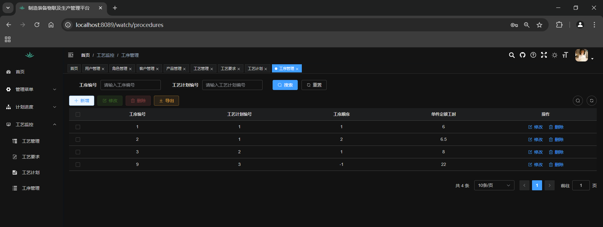

**新增工序：**
点击“新增工序”，填写工序编号、计划编号、顺序、定额工时等信息，保存后工序记录即刻生效。

**修改工序：**

在工序管理列表中点击“修改”按钮，修改工序信息并保存。

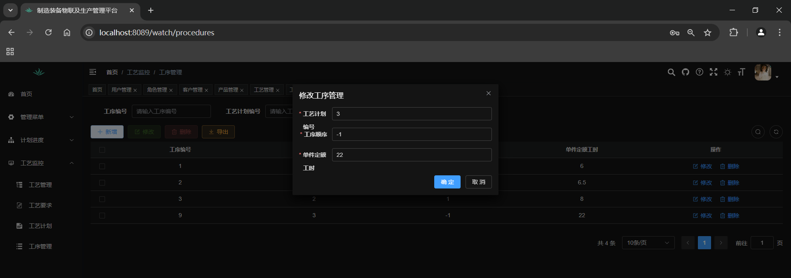

**删除工序：**

在工序列表中选择目标工序，点击“删除”按钮确认删除操作。

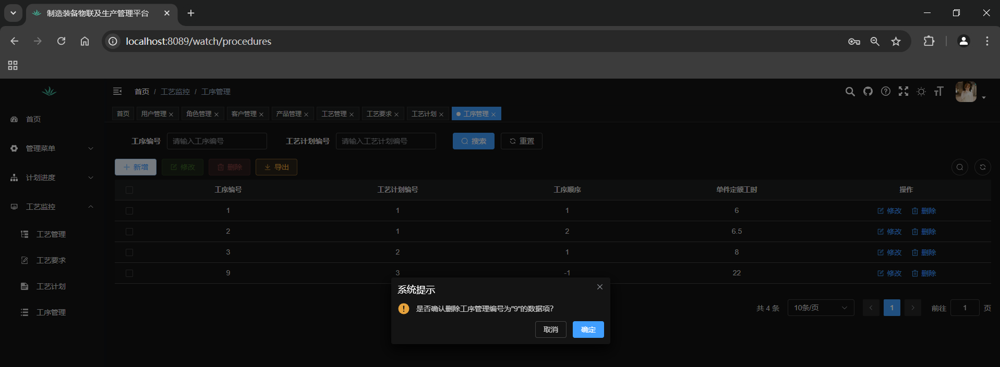

------

## 5. 注意事项

1. 系统中所有新增、编辑和删除操作均需要权限控制，请确保使用有权限的账户进行操作。
2. 数据操作后，相关数据会实时更新，刷新页面即可查看最新信息。
3. 对于工艺管理、工艺要求、工艺计划等复杂数据项，建议严格按照业务流程逐步创建，避免数据错乱或依赖关系错误。
